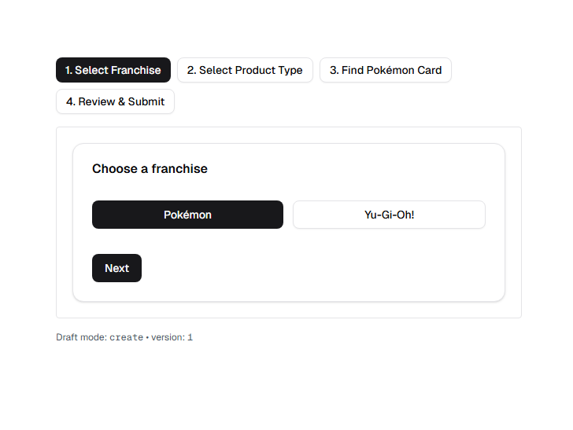
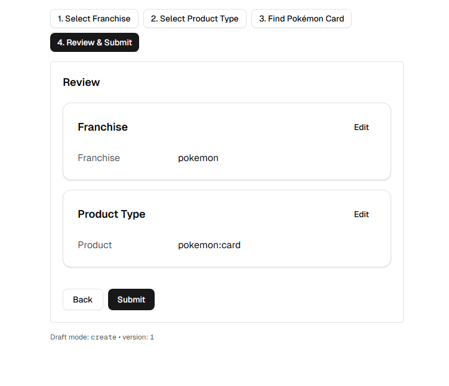

# Multi Step Form Example

Little project that attempts to show how to make a grpah-like defined multi step form. Allowing user to move forward and back between each step.

Packages:

- NextJS
- Shadcn
- TailwindCSS

## How to use

Run the app executing the following:

```bash
npm run dev
```

Navigate to localhost:3000/listing to then view the multi step form.

## Screenshots

Step preview



Review preview

